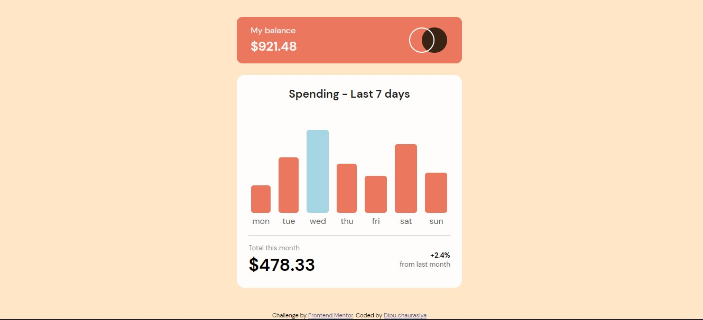

# Frontend Mentor - Expenses chart component solution

This is a solution to the [Expenses chart component challenge on Frontend Mentor](https://www.frontendmentor.io/challenges/expenses-chart-component-e7yJBUdjwt). Frontend Mentor challenges help you improve your coding skills by building realistic projects.

### Screenshot

### Links

- Solution URL: [Frontendmentor](https://www.frontendmentor.io/solutions/chart-component-using-html-css-and-javascript-iQNbx4RzNz)
- Live Site URL: [Live URL](https://admirable-marshmallow-fc0f00.netlify.app/)

### Built with

- HTML
- CSS
- javaScript

## Author

- Frontend Mentor - [@immdipu](https://www.frontendmentor.io/profile/immdipu)
- Twitter - [@immdipu](https://www.twitter.com/immdipu)
